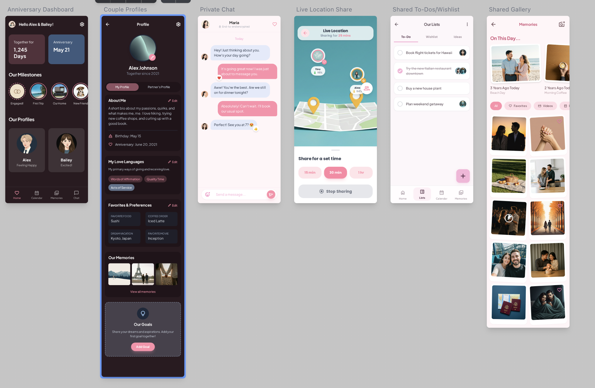

# YouMeUs – Couple Companion

An Expo + React Native experience for couples who want a single place to plan dates, track milestones, chat, and keep their shared rituals in sync. The app leans on Firebase (Auth, Firestore, Storage, Functions) and Expo Router to keep the experience real-time and cross-platform.

## Screenshots



## Feature Tour

- **Personal onboarding & pairing** – `app/onboarding/profile.tsx` guides each partner through avatars, birthdays, and love languages. `app/pairing/index.tsx` handles invite codes, QR links, and Cloud Function redemption so two accounts can merge into one couple space.
- **Anniversary dashboard** – The home tab (`app/(tabs)/index.tsx`) celebrates days together, tracks the anniversary date, and surfaces quick actions for chat, location sharing, milestones, or shared plans.
- **Shared calendar** – `app/(tabs)/calendar.tsx` renders a color-coded view of “we”, “hers”, and “his” calendars with day/month/year filters, event drills, notes, and reminders backed by `calendarService`.
- **Lists & planning** – The lists tab (`app/(tabs)/lists.tsx`) lets both partners manage categorized todos, moods, cost estimates, and proof photos. Custom categories sync through `todoService`.
- **Private chat** – `app/(tabs)/chat.tsx` sends text, image, and reaction messages with read receipts, pending queues, and avatar bubbles stored via `messageService`.
- **Milestones & gallery** – `app/milestone/new.tsx` and `app/gallery/index.tsx` turn shared milestones into a visual archive, complete with uploads to Firebase Storage and flashback prompts.
- **Live location check-ins** – `app/location.tsx` uses `expo-location` to request permission, update the couple document, and show opt-in live sharing cards for each partner.
- **Profiles, favorites & love languages** – `app/profile.tsx` exposes editable basics, accent colors, love languages, and favorite entries, with persistence handled by `profileService` and `userService`.
- **Settings & rituals** – `app/settings.tsx` toggles push reminders, flashbacks, and color accents, while `context/AppDataContext.tsx` keeps everything reactive with a single source of truth.

## Tech Stack

- Expo Router + React Native + TypeScript
- Firebase Auth, Firestore, Cloud Storage, Cloud Functions (see `firebase/`)
- Expo modules: `expo-location`, `expo-image-picker`, `expo-linear-gradient`, `expo-haptics`, etc.
- UI helpers: custom Cute* components, `react-native-calendars`, `@react-native-community/datetimepicker`

## Getting Started

### Prerequisites

- Node.js 20+
- npm 10+
- An Expo account (optional, but helpful for running on devices)
- A Firebase project with Web credentials and the following products enabled: Auth (email/password + anonymous), Firestore, Storage, Functions (for invite redemption)

### 1. Configure environment variables

Copy the sample file and fill in your Firebase + OAuth credentials:

```bash
cp .env.example .env
```

| Variable | Description |
| --- | --- |
| `EXPO_PUBLIC_FIREBASE_*` | Standard Firebase Web config values (API key, domain, project ID, storage bucket, sender ID, app ID, measurement ID) pulled in by `firebase/config.ts`. |
| `EXPO_PUBLIC_GOOGLE_IOS_CLIENT_ID` | Optional Google sign-in client used for the native flow. |
| `EXPO_PUBLIC_GOOGLE_WEB_CLIENT_ID` | Optional Google sign-in client for web / Expo Go. |

Because these keys are prefixed with `EXPO_PUBLIC_`, they are bundled into the client. Only include values you are comfortable exposing in the app.

### 2. Install dependencies

```bash
npm install
```

### 3. Start the Expo dev server

```bash
npm start
```

Use the on-screen CLI to launch iOS Simulator (`i`), Android Emulator (`a`), or scan the QR code with Expo Go.

### Helpful scripts

| Command | What it does |
| --- | --- |
| `npm run start` | Boots the Expo Metro bundler. |
| `npm run android` / `npm run ios` | Builds a development binary for the respective platform. |
| `npm run web` | Runs the project in a web browser via Expo. |
| `npm run lint` | Uses `eslint-config-expo` to lint TypeScript + React components. |
| `npm run reset-project` | Moves the starter template out of the way if you ever want a blank `app/`. |

## Project Structure

```
app/                   # File-based routing for screens (tabs, onboarding, pairing, etc.)
components/            # Cute* UI primitives (cards, text, buttons, dropdowns)
context/AppDataContext.tsx   # Centralized reducer-powered store for auth, chat, todos, gallery, etc.
firebase/              # Config, typed services, security rules, and Cloud Functions
services/              # Auth helper plus typed service wrappers used throughout the app
theme/ & hooks/        # Palette + styling utilities shared across screens
utils/                 # Date helpers, formatting, and misc calculations
data/                  # Seed data (love languages, initial state)
```

## Firebase Notes

- Firestore data models live in `firebase/types.ts`, and `firebase/services.ts` wraps collection access for users, couples, todos, chat, gallery memories, milestones, and locations.
- Storage uploads (avatars, milestones) stream from mobile via the `uploadBytes` helpers that first fetch the local file and then push to `gs://`.
- Cloud Functions inside `firebase/functions` support invite redemption and any server-side tasks you build on top of the pairing flow.
- Remember to deploy or emulate `firestore.rules` and `storage.rules` while developing to protect user content.

## Continuous Integration

`.github/pipeline.yaml` defines a minimal GitHub Actions workflow (push + pull_request on `main`) that installs dependencies with Node 20 and runs `npm run lint`. Use it as a baseline for adding Expo EAS builds or test automation later.

---

Questions, ideas, or found a bug? Open an issue or start a new branch and extend from there—every screen is intentionally isolated to make experimentation easy.
